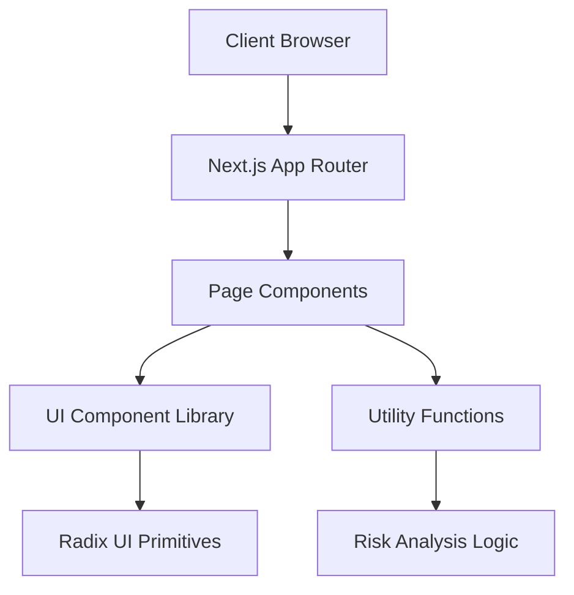

<div align="center">
  

  <p align="center">
    <strong>Flood Analyzer & Risk Detection System</strong><br>
    <i>Advanced monitoring and risk assessment for torrent-based traffic and flood patterns.</i>
  </p>

  <div align="center">
    
    
    
    
    
  </div>
</div>

---

## 📖 Description

**Torrent Guard** is a sophisticated risk detection and flood analysis application designed to monitor, analyze, and mitigate risks associated with torrent traffic. By leveraging a modern web interface, it provides real-time visibility into flood patterns and risk metrics, allowing administrators to identify anomalies and protect network integrity.

The project is built as a high-performance web application utilizing the **Next.js App Router** architecture, ensuring a seamless user experience with a highly responsive, accessible UI powered by **Radix UI** and **Tailwind CSS**.

## 🗺️ Table of Contents

- [🚀 Features](#-features)
- [🛠️ Tech Stack](#️-tech-stack)
- [📦 Getting Started](#-getting-started)
- [🏗️ Architecture](#️-architecture)
- [📂 Folder Structure](#-folder-structure)
- [⚙️ Usage](#️-usage)
- [🤝 Contributing](#-contributing)
- [📄 License](#-license)

---

## 🚀 Features

| Feature | Description | Status |
| :--- | :--- | :---: |
| **Flood Analysis** | Real-time detection of traffic spikes and flood patterns. | ✅ |
| **Risk Assessment** | Automated risk scoring based on traffic behavior and source. | ✅ |
| **Responsive Dashboard** | Modern, adaptive UI for monitoring across all device sizes. | ✅ |
| **Modular UI Components** | Atomic design system using Radix UI for accessibility and consistency. | ✅ |
| **Type-Safe Logic** | Full TypeScript integration for robust data handling and error prevention. | ✅ |
| **Rapid Deployment** | Optimized build pipeline via Next.js for production-grade performance. | ✅ |

---

## 🛠️ Tech Stack

### Frontend
- **Framework:** [Next.js 15+](https://nextjs.org/) (App Router)
- **Language:** [TypeScript](https://www.typescriptlang.org/)
- **Styling:** [Tailwind CSS](https://tailwindcss.com/)
- **UI Components:** [Radix UI](https://www.radix-ui.com/) (Primitives) & [Lucide React](https://lucide.dev/) (Icons)

### Tooling
- **Build System:** PostCSS, TypeScript Compiler
- **Linting:** ESLint
- **Environment:** Node.js

---

## 📦 Getting Started

### Prerequisites
- **Node.js**: v18.x or higher
- **npm** or **yarn**

### Installation

1. **Clone the repository**
   ```bash
   git clone https://github.com/dharunkumar-sh/torrent-guard.git
   cd torrent-guard
   ```

2. **Install dependencies**
   ```bash
   npm install
   ```

3. **Run the development server**
   ```bash
   npm run dev
   # or use the provided shell script
   ./start-dev.sh
   ```

4. **Open the application**
   Navigate to `http://localhost:3000` in your browser.

---

## 🏗️ Architecture

Torrent Guard follows a modular frontend architecture, separating the UI logic (Components) from the business logic (Lib) and the page routing (App).



---

## 📂 Folder Structure

<details>
<summary>Click to expand file tree</summary>

```text
torrent-guard/
├── app/                # Next.js App Router (Pages & Layouts)
│   ├── layout.tsx      # Root layout wrapper
│   ├── page.tsx        # Main dashboard entry point
│   └── globals.css     # Global styles & Tailwind directives
├── components/         # Reusable UI components
│   ├── ui/             # Atomic UI components (Button, Input, Card, etc.)
│   │   ├── alert-dialog.tsx
│   │   ├── badge.tsx
│   │   ├── button.tsx
│   │   └── ...
│   └── ...
├── lib/                # Utility functions and shared logic
│   └── utils.ts        # Tailwind merge & clsx helpers
├── public/             # Static assets (logos, icons)
├── tsconfig.json       # TypeScript configuration
├── next.config.ts      # Next.js configuration
└── package.json        # Project dependencies and scripts
```
</details>

---

## ⚙️ Usage

### Analyzing Traffic
1. Navigate to the main dashboard.
2. Input the target identifier or upload the traffic log.
3. The **Risk Detection** engine will process the data and highlight high-risk patterns using the `Alert` and `Badge` components.
4. Use the `Tabs` interface to switch between **Analysis**, **Risk Logs**, and **Settings**.

### Component Integration
To add a new UI element, utilize the existing design system in `components/ui`:
```tsx
import { Button } from "@/components/ui/button"
import { Badge } from "@/components/ui/badge"

export default function RiskCard() {
  return (
    <div className="p-4 border rounded-lg">
      <Badge variant="destructive">High Risk</Badge>
      <Button onClick={() => analyze()}>Analyze Now</Button>
    </div>
  )
}
```

---

## 🤝 Contributing

Contributions are welcome! Please follow these steps:

1. Fork the Project.
2. Create your Feature Branch (`git checkout -b feature/AmazingFeature`).
3. Commit your Changes (`git commit -m 'Add some AmazingFeature'`).
4. Push to the Branch (`git push origin feature/AmazingFeature`).
5. Open a Pull Request.

---

## 📄 License

This project is currently unlicensed. Please contact the maintainer for usage permissions.

---

<div align="center">
  <p>Developed with ❤️ by <a href="https://github.com/dharunkumar-sh">dharunkumar-sh</a></p>
</div>
